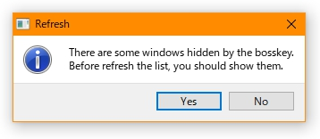

# BossKeyManager
+ A boss key manager for the programs shown in the taskbar

### Environment
+ `QT 5.5.1 32-bit (MSVC 2010)`
+ `Windows 10 Version 1803`
+ `QxtGlobalShortcut for QT5`

### Support actions
+ Minimize the window directly and the icon in taskbar will not hide
	+ `ShowWindowAsync(hwnd, SW_MINIMIZE)`

+ Hide the window directly and the icon in taskbar also
	+ `ShowWindowAsync(hwnd, SW_HIDE)`

+ Check the window active when action
	+ `wnd.needActive && wnd.hnd != GetForegroundWindow()`

### Execute
+ Build by `windeployqt`
+ Visit [Release](https://github.com/Aoi-hosizora/BossKeyManager/releases) to download zip file, **DO NOT delete the dll files**.

### Screenshot

 

### References
+ [cmdow](https://github.com/ritchielawrence/cmdow)
+ [qxtglobalshortcut5](https://github.com/ddqd/qxtglobalshortcut5)
+ [Limit QKeySequence/QKeySequenceEdit to only one shortcut](https://stackoverflow.com/questions/30006562/limit-qkeysequence-qkeysequenceedit-to-only-one-shortcut)
+ [getting-a-list-of-all-open-windows-in-c-and-storing-them](https://stackoverflow.com/questions/42589496/getting-a-list-of-all-open-windows-in-c-and-storing-them)
+ [获取 Windows 操作系统当前所有进程PID、进程名称](https://blog.csdn.net/kingkee/article/details/98115433)
+ [音量ミキサーのアプリ別音量を設定するサンプル](https://resemblances.click3.org/?p=1861)